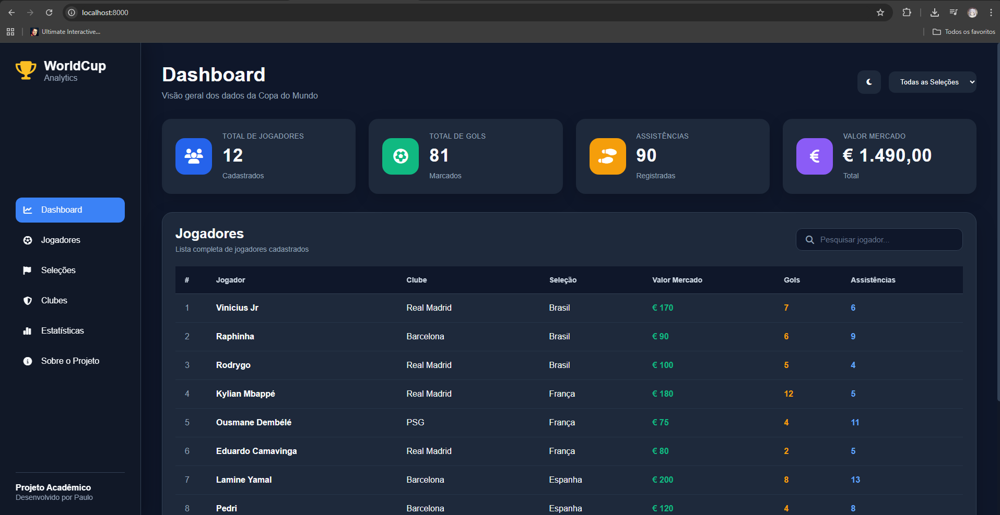
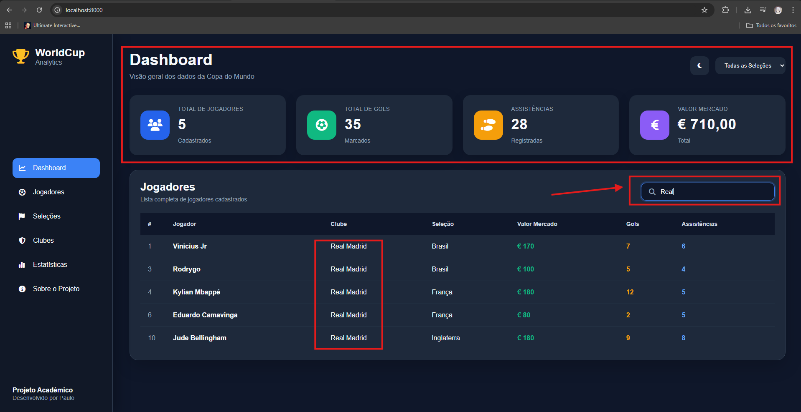
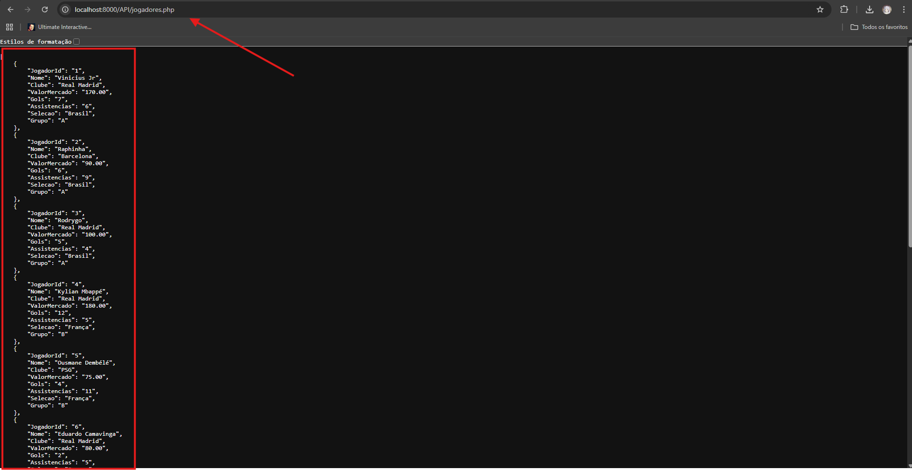
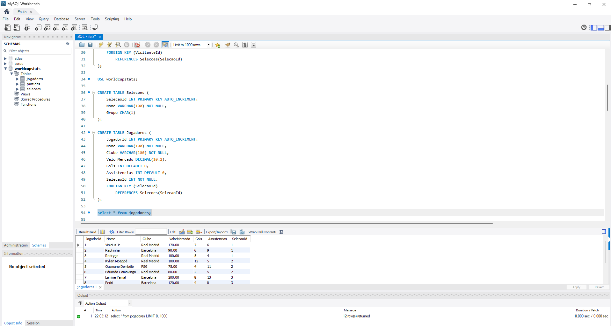
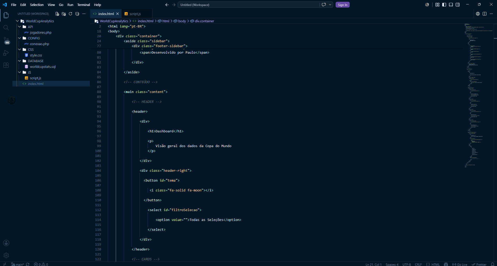
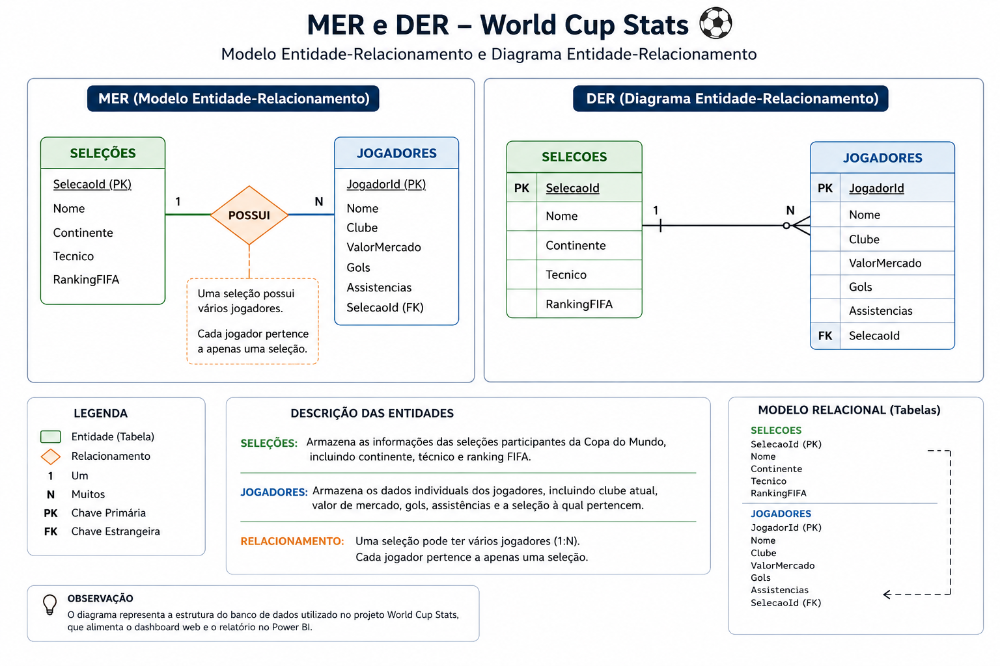

# 🏆 WorldCup Analytics



Um dashboard web desenvolvido para análise de dados de jogadores da Copa do Mundo utilizando HTML, CSS, JavaScript, PHP e MySQL.

O projeto foi desenvolvido com o objetivo de integrar conceitos de desenvolvimento web, banco de dados e consumo de APIs, proporcionando uma interface moderna para consulta e análise de informações dos jogadores.

---

## 🚀 Tecnologias Utilizadas

- HTML5
- CSS3
- JavaScript (ES6)
- PHP
- MySQL
- Font Awesome

---

## 📌 Funcionalidades

- Dashboard com indicadores em tempo real
- Consumo de dados através de API em PHP
- Integração com banco de dados MySQL
- Pesquisa dinâmica de jogadores
- Filtro por seleção
- Atualização automática dos indicadores conforme os filtros aplicados
- Tema Dark/Light
- Interface responsiva
- Estrutura organizada em módulos

---

## 📊 Indicadores

O sistema apresenta indicadores calculados automaticamente a partir dos dados armazenados no banco:

- Total de jogadores
- Total de gols
- Total de assistências
- Valor total de mercado

Todos os indicadores são atualizados dinamicamente conforme os filtros utilizados pelo usuário.

---

## 🗂 Estrutura do Projeto

```
WorldCupAnalytics
│
├── API
│   └── jogadores.php
│
├── CONFIG
│   └── conexao.php
│
├── CSS
│   └── style.css
│
├── DATABASE
│   └── worldcupstats.sql
│
├── JS
│   └── script.js
│
└── index.html
```

---

## ⚙️ Como Executar

1. Clone o repositório.

2. Importe o arquivo:

```
DATABASE/worldcupstats.sql
```

para o MySQL.

3. Configure a conexão em:

```
CONFIG/conexao.php
```

4. Inicie um servidor PHP:

```bash
php -S localhost:8000
```

5. Acesse:

```
http://localhost:8000
```

---

## 📷 Demonstração

### 🖥️ Interface Principal


---

### 🔎 Pesquisa e Filtros Dinâmicos

Os indicadores são atualizados automaticamente conforme os filtros aplicados.



---

### 🔗 API em PHP

Os dados são disponibilizados por uma API REST que retorna JSON para o frontend.



---

### 🗄️ Banco de Dados MySQL

Estrutura e dados utilizados pela aplicação.



---

### 📁 Estrutura do Projeto

Organização dos diretórios e arquivos.



---

### 📐 Modelagem do Banco de Dados

Modelo Entidade-Relacionamento (MER) e Diagrama Entidade-Relacionamento (DER).



---

## 📚 Objetivo Acadêmico

Este projeto foi desenvolvido como atividade prática da disciplina de Banco de Dados, aplicando conceitos de:

- Modelagem Relacional
- APIs REST utilizando PHP
- Integração Front-end e Back-end
- Manipulação de dados com JavaScript
- Consultas SQL
- Desenvolvimento Web

---

## 🔄 Próximas Atualizações

Este projeto continuará recebendo melhorias.

A próxima etapa será a integração com ferramentas de **Business Intelligence (BI)**, incluindo dashboards analíticos desenvolvidos no **Microsoft Power BI**, permitindo análises mais completas por meio de gráficos, indicadores e visualizações interativas construídas a partir da base de dados do projeto.

O objetivo é expandir o sistema, transformando-o em uma solução que reúna tanto o dashboard web quanto dashboards analíticos voltados à inteligência de dados.
